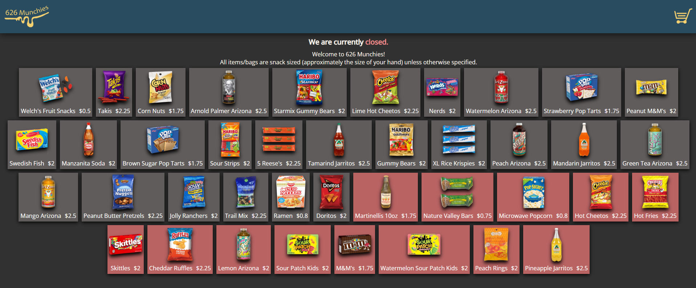

<div align="center">
  <a href="https://github.com/fryles/portershop">
    
  </a>

<h3 align="center">Porter Shop</h3>

  <p align="center">
    An ecommerce website designed to distribute snacks to students living in the Porter Dorms.
    <br />
    <a href="http://626munchies.com">View Website</a>
|
    <a href="https://github.com/fryles/portershop/issues">Report Bug or Request Feature</a>

  </p>
</div>



### Usage

While not particularly useful anymore, this project is an example of one of the simplest ways to get started with ecommerce.
The only money put into this website was to purchase the domain. Hosting and database management are done via Heroku.
For demonstration purposes, I have left the database and site running at [626Munchies.com](https://626munchies.com), however, the store will be closed, and therefore not functional.

### Features

- Payments done via a Venmo URL scheme constructor that works on mobile and desktop.
- Aforementioned URL is dynamically converted to a QR code if on desktop.
- Inventory and open status is managed via a Postgres database hosted with Heroku.
- A simple admin panel is available to manage inventory, open status, and confirm payments for orders.
- Once payments are confirmed, the order is marked as complete, and the items are taken from inventory and distributed to the students.
- In addition to the above, orders are also sent to a spreadsheet for tracking and analysis using Google Sheets' API.

### Deploying Yourself

I recommend using the Heroku CLI to deploy the website locally, then pushing to the Heroku app.
To accomplish this, create a Heroku account and run

```sh
git clone https://github.com/Fryles/PorterShop
cd PorterShop
npm install
```

This will install all dependencies for the project.
Next, login and create a new Heroku app.

```sh
heroku login
heroku create
```

To fully deploy the app, you will need to visit the Heroku website and install the postgres addon for this app.
Find the newly created database URL and use it to set the DATABASE_URL environment variable with

```sh
cat <<EOF >.env
ADMIN_PASS:
ADMIN_USER:
DATABASE_URL:
VENMO:
EOF
vim .env
```

Finally, run `heroku local` to start the app locally.
From here you can visit the website at [localhost:5000/adminlogin](http://localhost:5000/adminlogin) to login with your credentials and manage the inventory.

### Built With

- [Heroku](https://www.heroku.com/)
- [Postgres](https://www.postgresql.org/)
- [NodeJS](https://nodejs.org/)
- [JQuery](https://jquery.com/)
